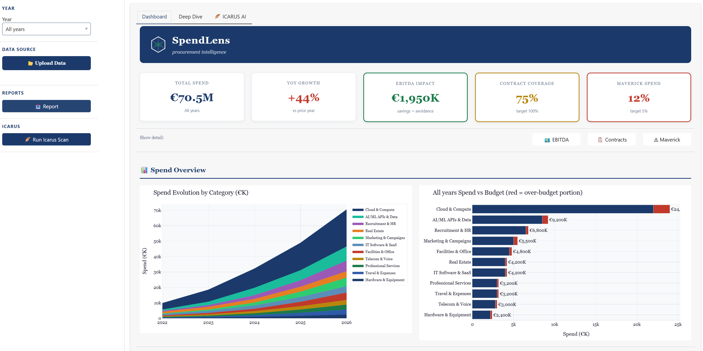
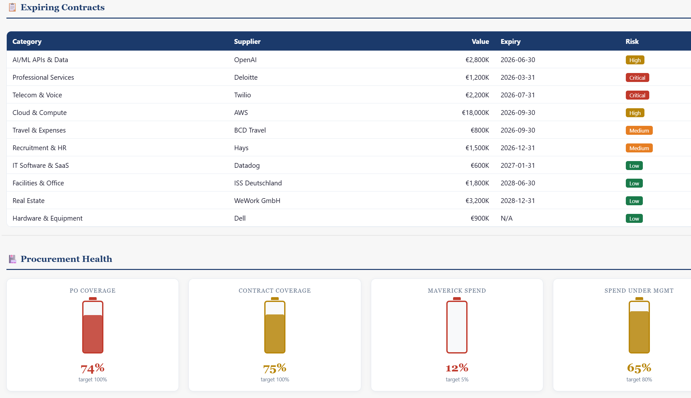
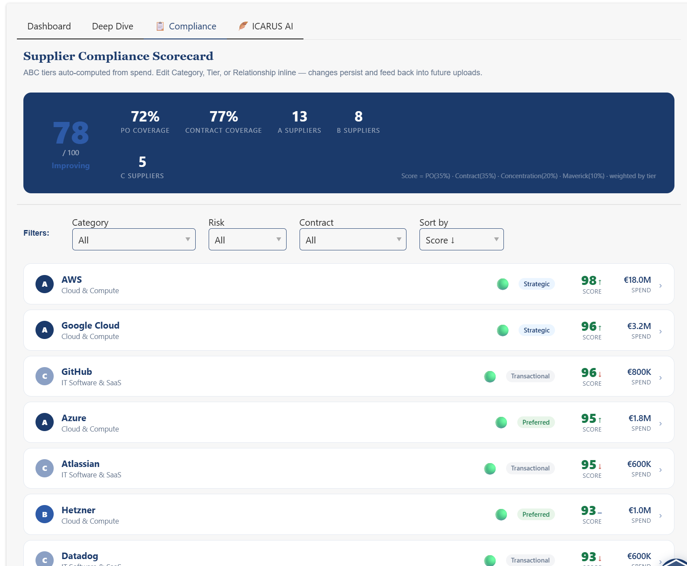
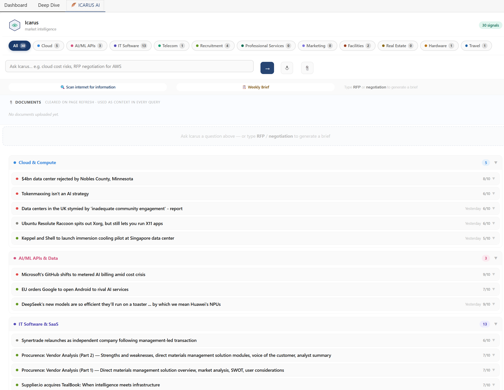
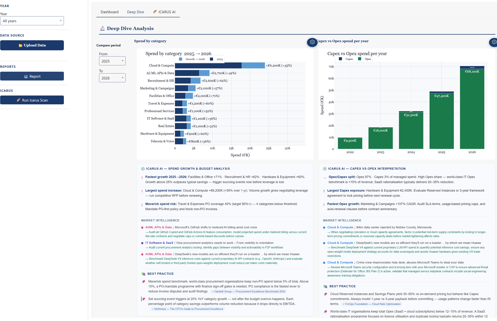

# SpendLens
### AI-Powered Procurement Intelligence

**Live:** [procurement-production-f940.up.railway.app](https://procurement-production-f940.up.railway.app)

> *Procurement has been running on static reports and manual analysis for decades. SpendLens changes that.*

---

## What is SpendLens?

SpendLens is a procurement intelligence platform that takes raw accounting and spend data — messy, inconsistent, multi-source — and turns it into a living knowledge base that gets smarter with every upload.

It combines a five-stage AI pipeline for data processing, a Panel-based analytics dashboard, and **Icarus** — an embedded market intelligence agent that monitors RSS feeds, answers procurement questions in natural language, and generates negotiation briefs on demand.

Built by someone who has worked in enterprise procurement. The features come from knowing what a category manager needs at 11pm before a supplier negotiation, not from a product spec.



---

## The Problem It Solves

Enterprise procurement teams are sitting on top of valuable data they cannot read.

It lives in SAP exports, Coupa reports, accounting spreadsheets, and Excel files emailed at month-end. Someone spends three days cleaning it, another week building pivot tables, and by the time a report lands on the CFO's desk it's already stale.

Meanwhile:
- Shadow IT keeps growing — nobody knows how many SaaS tools are being expensed without approval
- Freelancers are paid under personal names with no PO, no contract, no visibility
- A vendor justifies a 22% price increase with "market conditions" — and procurement has no data to push back
- A contract expires quietly, auto-renewal kicks in, another year at last year's price

**SpendLens is built for the real world** — not for companies whose data is already clean.

---

## Core Features

### Five-Stage Upload Pipeline

```
Raw Upload (CSV / Excel / Multi-source)
         │
         ▼
   Column Mapper        — maps any column names to standard schema
         │               rule-based + Claude API fallback
         ▼
   Data Cleanup         — normalizes formats, deduplicates vendors,
         │               handles German / English / ERP data formats
         ▼
   Category Mapper      — AI classification into 11 procurement categories
         │               chunked batching, persistent cache, ~$0.05/1000 vendors
         ▼
   Flag Engine          — derives compliance & risk flags per transaction
         │               maverick, shadow IT, freelancer, PO status, patterns
         ▼
   Intelligence Layer   — spend trends, anomalies, pattern detection
                          built on a persistent transaction timeline
```

Every stage is designed to handle the reality of enterprise data — missing fields, inconsistent formats, multiple source systems.

### 11-Category Procurement Taxonomy

> Cloud & Compute · AI/ML APIs & Data · IT Software & SaaS · Telecom & Voice · Recruitment & HR · Professional Services · Marketing & Campaigns · Facilities & Office · Real Estate · Hardware & Equipment · Travel & Expenses

### Compliance & Risk Flags

| Flag | What it detects |
|------|----------------|
| PO Status | With PO / Blanket PO / No PO / Unknown |
| Contract Status | Under Contract / Expired / No Contract / Unknown |
| Maverick Spend | Off-contract or off-PO spend above configurable threshold |
| Shadow IT | Unauthorized SaaS/IT spend hidden in expenses or cost centers |
| Freelancer | Spend under personal names across HR sub-commodity |
| Spend Pattern | Recurring / Blanket PO / One-off / Irregular |



### Supplier Compliance Scorecard

ABC supplier tiers are auto-computed from spend (A = top 80%, B = next 15%, C = remainder) with a criticality bump for sole-source or Critical-risk suppliers. Each card shows compliance score (PO coverage 35% · contract coverage 35% · concentration 20% · maverick 10%), contract status at a glance (🟢 Under Contract · 🟡 Expiring Soon · 🔴 No Contract / Expired), score trend vs previous evaluation, and relationship status. Click any card to expand inline editing of Category, Tier, and Relationship — changes persist to SQLite and back-propagate to the vendor classification cache.



### Persistent Knowledge Base

SpendLens never overwrites previous data. Every upload appends to a transaction timeline. Vendor classifications, spend patterns, and compliance flags accumulate over time.

---

## Category Strategy — AI-Powered Strategy Workbench

The Category Strategy tab is where a category manager prepares, documents, and exports their procurement strategy — fully inside SpendLens, no external tools needed.

**One click generates all 7 frameworks from live spend data + Icarus market signals:**

| Framework | Output |
|-----------|--------|
| **Kraljic Matrix** | Positions the category (Strategic / Leverage / Bottleneck / Non-critical) with supply risk + profit impact scores, recommended posture, and key actions |
| **PESTEL** | 3 procurement-impact bullet points per dimension, seeded from Icarus signals |
| **SWOT** | Buyer-perspective 2×2 grid derived from spend data and market conditions |
| **Porter's Five Forces** | Power assessment for all 5 forces with High/Medium/Low ratings and contributing factors |
| **TCO Breakdown** | True cost beyond invoice price: implementation, integration, resource, compliance overhead |
| **Negotiation Levers** | Prioritised levers with saving potential (%) and effort rating (Low/Medium/High) |
| **Strategy Recommendation** | 3-year roadmap: Year 1 execution priorities, Year 2 build agenda, Year 3 vision, success KPIs |

Results persist to SQLite — switching categories and returning later shows the saved strategy instantly, with no re-generation needed unless the market has moved.

**Slide deck export:** The "Generate Strategy Deck" button downloads a standalone HTML file — 10 professional slides covering all frameworks. SpendLens logo top-right on every slide, navy/green color scheme. Opens in any browser; keyboard arrow keys or on-screen buttons navigate; `Ctrl+P` to print each slide as a page.

---

## Icarus — Market Intelligence Agent

Icarus is the live intelligence layer embedded in SpendLens. It answers the question procurement teams can never answer today: *is this price increase actually justified?*

**Capabilities:**

| Feature | Description |
|---------|-------------|
| RSS Signal Scan | Fetches and deduplicates articles across 9 curated sources (Reuters, The Register, Handelsblatt, DatacenterDynamics, Spend Matters and more). Each article is scored for procurement relevance (1–10), classified by impact, and assigned a suggested action. |
| Ask Icarus | Natural language queries against current signals and live article context. Ask *"What are the cloud cost risks this week?"* and get a structured answer with supporting market signals. |
| RFP & Negotiation Prep | Type `RFP`, `negotiation`, or `tender` to generate a structured negotiation brief: market context, leverage points, key requirements, risk areas, suggested contract terms, and next steps — built from real market signals. |
| Document Context | Upload contracts, pricing sheets, or agreements (PDF, DOCX, XLSX, TXT) via the paperclip icon. Icarus reads the documents in-session and uses them as context in every query. Documents are stored in memory only — cleared on page refresh, never written to disk. |
| Weekly Intelligence Brief | One click generates an executive summary of the past 7 days: top risks, opportunities, priority actions, and per-category highlights. |
| Feedback Learning | Thumbs up / down on any signal feeds into per-category weights so Icarus learns your priorities over time. |

When AWS raises your bill 18%, SpendLens doesn't just show you the number. It shows you that GPU spot prices rose 6%, US data center energy costs rose 4%, and the remaining 8% gap has no market justification. That's a negotiation, not an invoice to approve.



---

## Architecture

```
app.py                          — Panel dashboard, tab layout, upload orchestration
icarus.py                       — Market intelligence agent (RSS, Claude API, SQLite)
icarus_ui.py                    — Icarus Panel UI component
category_strategy_ui.py         — Category Strategy Panel UI component
modules/
  column_mapper.py              — Schema normalization (fuzzy + Claude fallback)
  data_cleanup.py               — Spend normalization, deduplication
  category_mapper.py            — AI vendor classification (chunked + cached)
  flag_engine.py                — Compliance & risk flag derivation
  database.py                   — SQLite persistence (WAL mode, hash dedup)
  cfo_reports.py                — Excel export generation
  category_strategy.py          — Category strategy AI calls + SQLite persistence
  deck_generator.py             — Standalone HTML slide deck generator
```

**Persistence:**
- `clients/{name}/spendlens.db` — per-client SQLite. Tables: `uploads`, `transactions_raw`, `transactions_enriched`, `vendors`, `matches`, `category_strategies`
- `clients/{name}/icarus_memory.db` — Icarus signals, feedback, category weights
- `vendor_cache.json` — vendor→category cache; survives restarts, minimises API costs

---

## Tech Stack

| Layer | Technology |
|-------|-----------|
| Dashboard | Panel (HoloViz) |
| Charts | Plotly |
| Data processing | Pandas |
| AI classification & intelligence | Claude API (Anthropic) · Grok API (xAI) |
| Persistent storage | SQLite |
| News scraping | feedparser |
| Validation | Pydantic |
| Export | openpyxl |
| Document parsing | pypdf, python-docx |
| Language | Python 3.11+ |

---

## Recent Updates

**April 2026**
- **Category Strategy tab** — AI-powered strategy workbench with 7 procurement frameworks (Kraljic, PESTEL, SWOT, Porter's Five Forces, TCO, Negotiation Levers, 3-year Recommendation). One click generates all from live spend + Icarus signals. Results persist to SQLite. Exports a professional 10-slide HTML deck with SpendLens branding.
- **Grok (xAI) live search integrated** — Icarus now queries Grok-3-mini alongside RSS feeds; 3 topic-cluster calls per scan surface real-time X posts and breaking news before it reaches RSS; ~$0.002/scan extra cost
- **ICARUS AI data interpretation strips** — each Deep Dive chart now shows 3 procurement-focused insight bullets derived from live spend data: maverick spend / PO coverage risk, budget overrun alerts, single-source exposure, contract coverage gaps, Capex/Opex ratio vs industry benchmark
- **Period-aware spend analysis** — changing the From/To year selector instantly recalculates all insight bullets from local data (no API call); shows fastest growers, largest absolute mover, and PO compliance for the exact selected period
- **Icarus 5x speed improvement** — RSS feeds fetched in parallel (9 simultaneous connections); article analysis split into concurrent Haiku batches; full scan ~8s vs. 45s before
- **Icarus signals load on startup** — dashboard shows cached signals immediately on page open without requiring a scan
- Risk & Bottlenecks chart redesigned — log-scale axis, enlarged bubbles, total spend badge
- Deep Dive treemap with supplier drill-down — click any category tile to expand top suppliers; click a supplier to open a procurement intel card
- Spend comparison chart — pick any start/end year, see per-category growth as stacked bars sorted by size
- Capex/Opex rebuilt as multi-year stacked bar across all five years



---

## Running SpendLens

```bash
# 1. Clone and activate virtual environment
git clone <repo-url>
cd SpendLens_App
python -m venv .venv
source .venv/Scripts/activate      # Git Bash / macOS
# .venv\Scripts\activate           # Windows PowerShell

# 2. Install dependencies
pip install -r requirements.txt

# 3. Add your Anthropic API key
echo "ANTHROPIC_API_KEY=sk-ant-..." > .env

# 4. Start the dashboard
PYTHONUTF8=1 panel serve app.py --show --port 5006
```

> **Note for Windows users:** The `PYTHONUTF8=1` prefix is required to handle non-ASCII vendor names and German umlauts in spend data. Without it, parsing may fail silently on certain datasets.

---

## Product Roadmap

The table below maps the full procurement AI pipeline across 7 layers — what is live, what is the highest priority to build next, and what is optional.

### Layer 1 · Data Ingestion & Integration

| Component | Status | Notes |
|---|---|---|
| SpendLens upload pipeline (CSV / Excel) | ✅ Live | Fuzzy column mapping, German format support, dedup |
| ERP Live Connector (SAP S/4HANA, Ariba API) | 🔴 High priority | Eliminates manual exports — real-time spend feed |
| P-Card / Invoice OCR (unstructured docs) | ⬜ Optional | |

### Layer 2 · Spend Analytics & Intelligence

| Component | Status | Notes |
|---|---|---|
| Spend classification — 5-stage AI pipeline | ✅ Live | 11 categories, cached, ~$0.05/1000 vendors |
| Hermes market intelligence | ✅ Live | 590 suppliers, 17 procurement categories, Redis |
| Savings Tracker — budget vs. actual, variance | 🔴 High priority | CFOs expect this; gap between intent and result |

### Layer 3 · Sourcing & Supplier Management

| Component | Status | Notes |
|---|---|---|
| Triage Agent — RFQ/RFP generation, 5-tier routing | ✅ Live | Autonomous procurement request handling |
| Hades Due Diligence — 6 parallel DD nodes | ✅ Live | Sanctions, LkSG, ESG, Registry, News, Hermes |
| Supplier Performance Scorecard — SLA tracking | 🔴 High priority | Closes the loop from onboarding to performance |

### Layer 4 · Contract Lifecycle Management (CLM)

| Component | Status | Notes |
|---|---|---|
| Contract Extraction — clause AI, risk flagging | 🔴 High priority | PDF contracts → structured data, risk highlighted |
| Renewal Monitor — expiry alerts, obligations | 🔴 High priority | Prevents silent auto-renewals and missed exits |
| Negotiation Copilot — playbook AI, redlining | ⬜ Optional | |

### Layer 5 · Purchase-to-Pay (P2P)

| Component | Status | Notes |
|---|---|---|
| PR Chatbot / Copilot — guided buying, catalog | 🔴 High priority | Self-service purchasing, reduces off-contract buys |
| Invoice Matching — 3-way match, anomaly AI | 🔴 High priority | Catches duplicate payments and pricing errors |
| Maverick Spend Alerting — off-contract detection | ⬜ Optional | Partial coverage already via flag engine |

### Layer 6 · Compliance, ESG & Risk

| Component | Status | Notes |
|---|---|---|
| Hades Risk Engine — OFAC, LkSG, ESG, NCP | ✅ Live | Integrated into SpendLens Supplier DD tab |
| Scope 3 / CO₂ Tracker — emission per € spend | 🔴 High priority | CSRD mandatory reporting requirement from 2025 |
| Supplier Diversity Scorecard — SME, WBE % | ⬜ Optional | |

### Layer 7 · Reporting & CPO Dashboard

| Component | Status | Notes |
|---|---|---|
| CFO Excel Export | ✅ Live | SpendLens built-in, multi-tab workbook |
| Category Strategy slide deck (HTML export) | ✅ Live | 10 slides, Kraljic + 6 frameworks |
| CPO Live Dashboard — real-time KPIs, RAG status | 🔴 High priority | Executive view across all 7 layers |
| Natural Language Query — "Show me Q1 IT spend" | ⬜ Optional | |

---

### Additional Planned Capabilities

| Component | Status |
|---|---|
| ECB FX Rates — auto-convert multi-currency spend to EUR | 🔨 In progress |
| OpenCorporates — supplier legal registration enrichment | 🔨 In progress |
| Mobile — Telegram bot (signal push, scan on demand) | 📋 Planned |
| Mobile — Slack bot (weekly brief, scan on demand) | 📋 Planned |
| Quandl / Nasdaq Data Link — commodity price feeds | 📋 Planned |
| Creditsafe / D&B — supplier financial health & insolvency | 📋 Planned |
| Multi-client support with per-client isolation | 📋 Planned |
| Enterprise security — SSO, RBAC, audit log, encryption | 📋 Planned |

---

## Current Build Status

| Component | Status |
|-----------|--------|
| AI column mapper | ✅ Complete |
| Data cleanup engine | ✅ Complete |
| Category mapper (chunked + cached) | ✅ Complete |
| Flag engine | ✅ Complete |
| CFO Excel export | ✅ Complete |
| Dashboard — year-aware charts (all tabs) | ✅ Complete |
| Dashboard — Risk Map (log-scale, bubbles, spend badge) | ✅ Complete |
| Dashboard — Treemap with supplier drill-down | ✅ Complete |
| Dashboard — Supplier intel cards & market signals | ✅ Complete |
| Dashboard — Interactive spend comparison chart | ✅ Complete |
| Dashboard — Capex/Opex multi-year stacked bar | ✅ Complete |
| Icarus — RSS signal scanner | ✅ Live |
| Icarus — Ask / query mode | ✅ Live |
| Icarus — RFP & negotiation prep | ✅ Live |
| Icarus — Weekly intelligence brief | ✅ Live |
| Icarus — Document upload (in-memory) | ✅ Live |
| Icarus — Signal deduplication | ✅ Live |
| Icarus — Parallel fetch & batch analysis (5x faster) | ✅ Live |
| Icarus — Signals load on dashboard startup | ✅ Live |
| Icarus — Grok live search (real-time X + web signals) | ✅ Live |
| Icarus — AI data interpretation per chart | ✅ Live |
| Icarus — Period-aware spend insight bullets | ✅ Live |
| Icarus — Feedback learning loop | 🔨 In progress |
| Compliance Scorecard — EcoVadis-style cards, ABC tiers, inline editing | ✅ Live |
| Hades Supplier DD — 6-node LangGraph agent | ✅ Live |
| Hades — OFAC / UN SC sanctions check | ✅ Live |
| Hades — LkSG / CSDDD compliance signals | ✅ Live |
| Hades — ESG & labour signals | ✅ Live |
| Hades — Company registry lookup | ✅ Live |
| Hades — Hermes watchlist registration | ✅ Live |
| Category Strategy — 7 AI frameworks (Kraljic, PESTEL, SWOT, Porter's, TCO, Levers, Recommendation) | ✅ Live |
| Category Strategy — HTML slide deck export (10 slides, branded) | ✅ Live |

---

## Privacy & Data Handling

- **Uploaded documents** (contracts, pricing sheets) are held in memory only for the duration of the browser session. Nothing is written to disk. Refreshing the page clears all uploaded documents.
- **Spend data** is stored in a per-client SQLite database on the local machine. No data is sent to external services except vendor names and headlines for AI classification.
- **API key** is read from `.env` at startup and never logged or exposed in the UI.

---

## Enterprise Readiness

SpendLens is being built for company use — not as a proof of concept, but as a tool that can be deployed inside a real corporate environment and meet the security and compliance requirements that come with it.

Everything on this roadmap is built in-house. No integration consultants, no vendor lock-in, no six-month implementation projects.

**Planned capabilities:**

| Capability | What it means |
|---|---|
| **SSO — Single Sign-On** | Login via your company's existing identity provider: Azure Active Directory, Okta, or Google Workspace. No separate credentials to manage. |
| **Encryption at rest** | All spend data and supplier records encrypted on disk. Files are unreadable without the encryption key, even if the server is accessed directly. |
| **Encryption in transit** | All traffic between browser and server over HTTPS/TLS. No data exposed on the wire. |
| **Role-based access control** | Three roles — Reader, Editor, Administrator — with fine-grained control over who can upload data, edit suppliers, run AI scans, or manage users. |
| **Audit log** | Every action logged with timestamp and user: uploads, supplier edits, exports, AI queries. Full traceability for compliance reviews. |
| **Data residency** | SpendLens runs on your infrastructure — on-premises or in a cloud region of your choosing. Spend data never leaves your perimeter. |
| **Per-client data isolation** | Each company's data is fully isolated. No shared databases, no cross-client data leakage. |
| **Self-hosted deployment** | Packaged as a Docker container. IT can deploy and manage it without any dependency on external vendors. |
| **GDPR compliance** | Data processing agreement template included. Right-to-deletion endpoint. No personal data sent to third parties beyond vendor names for AI classification. |
| **Secrets management** | API keys stored in system-level secrets management — not in application config files. |
| **MFA support** | Multi-factor authentication enforced at the identity provider level via SSO. |
| **Dependency & vulnerability scanning** | Automated scanning of Python dependencies in CI pipeline before any deployment. |

The goal is a tool that a company's IT security team can evaluate, approve, and hand to procurement — without a six-figure consulting project in between.

---

## Background

SpendLens is built by someone who has worked in enterprise procurement — not just around it.

The AI layer doesn't replace procurement expertise. It amplifies it.

---

*Interested in the architecture, a demo, or contributing? Get in touch.*
